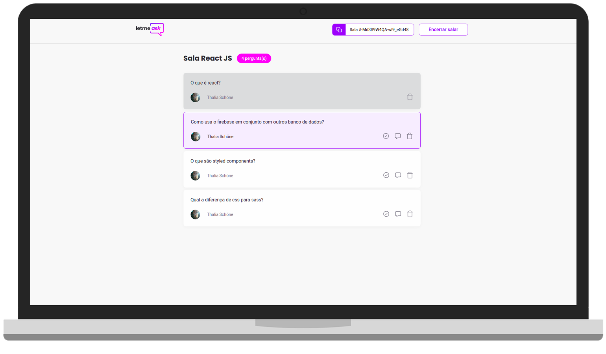

<h1 align="center">
    
</h1>

<h1 align="center">
    
</h1>

## ✨ Tecnologias

Esse projeto foi desenvolvido com as seguintes tecnologias:

- [React](https://reactjs.org)
- [TypeScript](https://www.typescriptlang.org/)
- [Firebase](https://firebase.google.com/?hl=pt)

## 💻 Projeto

O Letmeask é uma aplicação que auxilia a tirar as dúvidas da sua audiência em tempo real, com a criação de salas de Q&A ao vivo 💜 

<a href="https://letmeask-45476.web.app/">Veja o site </a>

## 🚀 Como executar

- Clone o repositório
- Instale as dependências com `yarn install`
- Inicie a aplicação com `yarn start`

Agora você pode acessar [`localhost:3000`](http://localhost:3000) do seu navegador.

---

Feito com ♥ by Thalia Schöne
